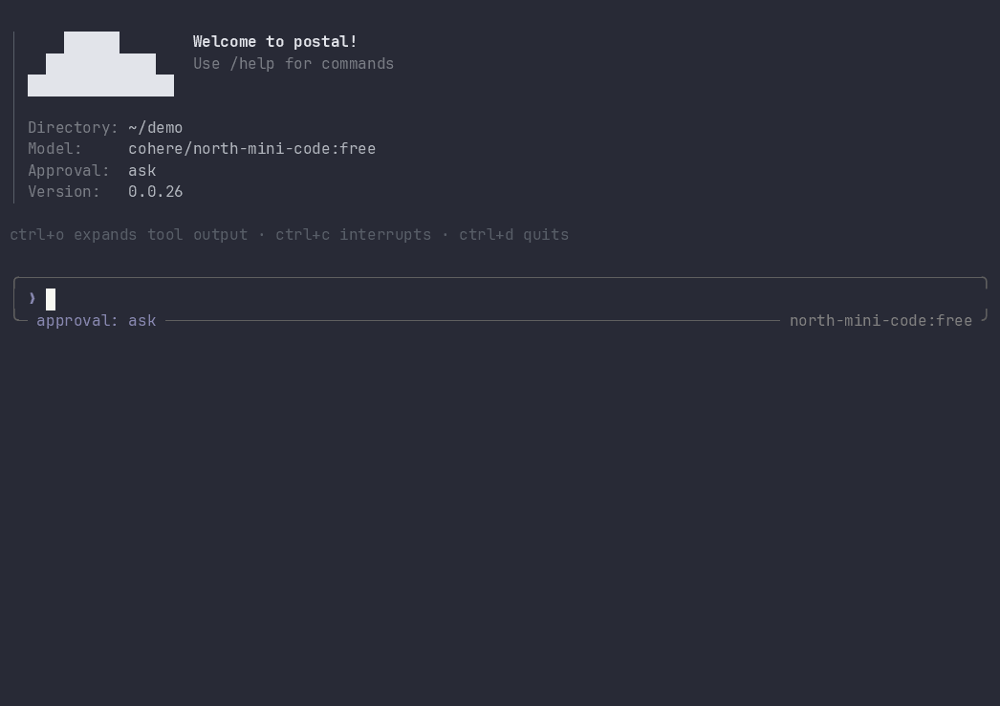

<h1 align='center'>
  Postal
</h1>

<p align="center">
  <b>An open-source AI coding agent that lives in your terminal.</b><br />
  Plans, edits, runs, and reviews code with any model on OpenRouter.
</p>

<p align="center">
  <a href="https://github.com/andrefetch/postal/stargazers"></a>
  <a href="https://github.com/andrefetch/postal/network/members"></a>
  <a href="https://github.com/andrefetch/postal/issues"></a>
</p>

<p align="center">
  
  
  
  
  
  <br />
  
  
  
</p>

<p align="center">
  
</p>

Postal connects to LLMs through OpenRouter, reads and edits your code with a built-in tool set, runs shell commands, delegates to specialized sub-agents, and streams everything through a full-screen TUI. Every mutating action goes through an approval policy you control, so it is as autonomous or as careful as you want it to be.

## Quickstart

Two commands and you are talking to an agent in your own repo:

```bash
pip install postalcli
postal login    # opens your browser to authorize with OpenRouter
postal          # start the interactive TUI
```

More ways to run it:

```bash
postal "your prompt"     # single-shot mode, great for scripting
postal --cwd /path       # run against a different working directory
postal --continue        # pick up the last session in this directory
postal --resume 3f2a1c   # resume a specific session by id
postal sessions          # list saved sessions
postal login --paste     # paste an API key instead of browser OAuth
postal logout            # remove the saved API key
```

Configuration options live in `~/.config/postal/config.toml`, with per-project overrides in `.postal/config.toml`. Here is a comprehensive example:

```toml
# Top-level settings
approval = "on_request"         # "on_request", "auto_edit", "auto", "never", "yolo"
allowed_tools = ["read", "write"] # Optional: restrict the agent to these tools
# developer_instructions = ""   # General instructions for the agent (overrides AGENTS.md when set)
# user_instructions = ""        # Instructions for the user's specific preferences
developer_instructions = ""     # General instructions for the agent
user_instructions = ""          # Instructions for the user's specific preferences
debug = false                   # Enable debug logging
hooks_enabled = true            # Enable or disable hooks globally

[model]
name = "anthropic/claude-sonnet-4.5"
temperature = 1.0
context_window = 256000

[reasoning]
enabled = true     # ask the model to think (ignored by models that cannot)
effort = "medium"  # "minimal", "low", "medium", "high", or omit for the provider default
# max_tokens = 4000  # a thinking budget instead of an effort level
visible = true     # stream the thinking into the transcript

[session]
enabled = true       # save the conversation so it can be resumed
max_checkpoints = 20 # snapshots kept per session
max_sessions = 50    # sessions kept before the oldest are dropped

[shell_environment]
ignore_default_excludes = false
exclude_patterns = ["*KEY*", "*TOKEN*", "*SECRET*"] # Filters environment variables
set_vars = { MY_VAR = "value" }                     # Injects environment variables

# Connect to external tools via MCP (Model Context Protocol)
[mcp_servers.my_server]
enabled = true
startup_timeout = 10.0
command = "npx"             # For stdio servers
args = ["-y", "my-server"]
env = { API_KEY = "123" }
# url = "http://..."        # Alternatively, use a URL for HTTP/SSE servers
cwd = "/path/to/dir"

# Run commands or scripts at specific points in the agent lifecycle
[[hooks]]
name = "lint_check"
trigger = "after_tool"      # "before_agent", "after_agent", "before_tool", "after_tool", "on_error"
command = "npm run lint"
# script = "..."            # Alternatively, specify a bash script directly
timeout_sec = 30.0
enabled = true
```

## Why Postal?

- **Bring any model.** OpenRouter as the backend means one login gives you Claude, GPT, Gemini, DeepSeek, open-weight models, and whatever ships next. No vendor lock-in.
- **Safety is a first-class feature.** Six approval policies, dangerous-command rejection, and confirmation for anything outside the working directory. You choose the risk level, not the agent.
- **It survives long sessions.** Context pruning reclaims tokens from stale tool output, and when the window fills up, Postal compacts history into a continuation brief and keeps going instead of erroring out.
- **Nothing is lost when you close the terminal.** Sessions are checkpointed after every turn, so `postal --continue` puts you back exactly where you were, and `/rewind` walks the conversation back to any earlier checkpoint.
- **Hackable by design.** A readable, object-oriented Python codebase built on Rich, Click, and Pydantic. Every tool is one class behind a shared abstract base, so adding a tool or a sub-agent is a small, well-marked change. See [Architecture](#architecture).
- **Component-based UI design.** Postal uses a modular, component-based UI system with separate components for every visual element (spinners, gutters, markdown rendering, tool displays, confirmations, etc.), making it easy to maintain, customize, and extend the interface.

## What it can do

### Tools
| | |
| --- | --- |
| **Files** | `read`, `write`, `edit`, `apply_patch`, `grep`, `glob`, and `list_directories` for working with a codebase. `apply_patch` batches creates, updates, deletes and renames across several files into one all-or-nothing call. |
| **Shell** | The `shell` tool executes commands in the working directory. |
| **Planning** | A `plan` tool tracks steps (a todo list) across the agent loop. |
| **Network** | Web search via DuckDuckGo and URL fetching. |
| **Memory** | Key-value storage that survives across sessions. |
| **MCP** | Connects to external MCP servers for additional tools and data sources. |

### Agent
| | |
| --- | --- |
| **Sub-agents** | Specialized agents the main agent can delegate to: `codebase_investigator`, `code_reviewer`, `software_architect`, `test_writer`, `debugger`. |
| **Approvals** | Mutating tool calls are gated by an approval policy, from confirming every write to running unattended. See [Approvals](#approvals). |
| **`AGENTS.md`** | Project instructions are picked up automatically and followed while working. |
| **Context pruning** | Old tool outputs are cleared once they pile up past the recent working set, reclaiming tokens without touching the conversation itself. |
| **Compaction** | When the context window fills up, history is summarized into a continuation brief and the session resumes from it instead of erroring out. |
| **Sessions** | Every turn is checkpointed to disk, so a conversation can be resumed, listed, or rewound to an earlier point. See [Sessions](#sessions). |

### Interface
| | |
| --- | --- |
| **Interactive TUI** | Full-screen terminal interface built on Rich, with streaming responses, live tool call output, and token usage tracking. |
| **Visible thinking** | Reasoning models stream their thinking into the transcript before the answer, dimmed under a gutter. Tune or hide it with `/thinking`. |
| **Slash commands** | Control the session without leaving it. See [Slash commands](#slash-commands). |
| **Single-shot mode** | Pass a prompt as an argument for non-interactive runs, suitable for scripting. |
| **Session management** | Save, list, resume, and rewind conversations from inside the TUI or from the command line. |

## Technologies

### Frontend

| | |
| --- | --- |
| **[Rich](https://github.com/Textualize/rich)** | The whole TUI: full-screen live rendering, streaming responses, tool call panels, diffs, markdown, and the color theme. |
| **[prompt-toolkit](https://github.com/prompt-toolkit/python-prompt-toolkit)** | The input line: key bindings, multiline editing, history, and slash command completion. |
| **[Pygments](https://pygments.org/)** | Syntax highlighting for code blocks and file previews rendered through Rich. |

### Backend

| | |
| --- | --- |
| **[Python 3.11+](https://www.python.org/)** | The agent loop is `asyncio`-based, so streaming, tool calls, and MCP connections run concurrently. |
| **[OpenAI SDK](https://github.com/openai/openai-python)** | The API client, pointed at OpenRouter's OpenAI-compatible endpoint for streaming and tool calling. |
| **[OpenRouter](https://openrouter.ai/)** | The model gateway. One login, any model, no per-vendor SDKs. |
| **[Pydantic](https://docs.pydantic.dev/)** | Config schemas, tool argument validation, and the JSON Schema sent to the model for each tool definition. |
| **[FastMCP](https://github.com/jlowin/fastmcp) / [MCP](https://modelcontextprotocol.io/)** | Connecting to external MCP servers and exposing their tools to the agent. |
| **[tiktoken](https://github.com/openai/tiktoken)** | Token counting that drives context pruning and compaction. |
| **[httpx](https://www.python-httpx.org/)** | Async HTTP for URL fetching and the OAuth token exchange. |
| **[ddgs](https://github.com/deedy5/ddgs)** | DuckDuckGo-backed web search. |
| **[Click](https://click.palletsprojects.com/)** | The `postal` CLI: flags, single-shot mode, and the `login` / `logout` subcommands. |
| **OAuth 2.0 + PKCE** | Browser login runs on a stdlib `http.server` loopback redirect, with the key stored locally. |
| **[platformdirs](https://github.com/tox-dev/platformdirs) + TOML** | Cross-platform config and credential paths, read with `tomllib`. |
| **[Docker](https://www.docker.com/)** | A `Dockerfile` and Compose file in [`docker/`](docker/) for running the agent sandboxed. |

## Architecture

Postal is built as an object-oriented codebase. The agent loop, the tools, the safety layer and the terminal UI are all classes with one responsibility each, wired together at startup instead of reaching for each other through globals. That is what keeps the project hackable: adding a tool or a sub-agent means writing one class and registering it, not threading a new branch through the loop.

### Packages

| Package | What lives there |
| --- | --- |
| `agent/` | `Agent` (the loop), `Session` (everything one conversation owns), `AgentEvent`, `SessionStore` |
| `tools/` | The `Tool` base class, `ToolRegistry`, and every concrete tool: core, network, memory, MCP, sub-agents |
| `client/` | `LLMClient` and the streaming response types |
| `context/` | `ContextManager`, `ChatCompactor`, `LoopDetector` |
| `safety/` | `ApprovalManager` and the approval policy types |
| `config/` | Pydantic config models and the TOML loader |
| `hooks/` | `HookSystem`, which runs lifecycle hooks |
| `ui/` | `TUI`, `Repl`, the slash command groups, and the render components |

### One abstract base class, every tool

Everything the model can call is a subclass of `Tool` (`tools/base.py`), an `abc.ABC` that declares `execute` abstract and gives everything else a working default. A tool is a class attribute block plus one method:

```python
class GlobTool(Tool):
    name = "glob"
    description = "Find files matching a glob pattern"
    kind = ToolKind.READ
    schema = GlobParams          # a pydantic BaseModel

    async def execute(self, invocation: ToolInvocation) -> ToolResult:
        ...
```

The base class handles the rest for every subclass: `validate_params` runs the Pydantic model, `to_openai_schema` turns the same model into the JSON Schema sent to the API, `is_mutating` decides from `kind` whether the approval layer gets involved, and `get_confirmation` builds the prompt the user sees.

Subclasses override only where their behaviour genuinely differs, which is the point of the base being concrete:

- `EditTool` and `WriteFileTool` override `get_confirmation` to attach a `FileDiff`, so the confirmation shows the exact patch instead of a generic "run edit".
- `MCPTool` overrides `is_mutating` to always return `True`, because a third-party server's side effects are unknowable.
- `SubAgentTool` turns `name` and `description` into properties, since both come from the `SubagentDefinition` handed to `__init__` — one class backs all five sub-agents.
- `ApplyPatchTool` keeps its multi-file staging in a private `_WorkingTree` helper class, so an all-or-nothing patch either commits every operation or none.

Because the loop only ever sees the base type, it never branches on which tool it is holding. `ToolRegistry` stores tools behind private `_tools` and `_mcp_tools` dicts and hands out `Tool` instances; the agent calls `execute` and lets dispatch do the work.

### Composition over deep hierarchies

Inheritance is one level deep almost everywhere. The structure comes from objects owning other objects:

- **`Session` is the composition root.** It constructs and owns the `LLMClient`, `ToolRegistry`, `ContextManager`, `ApprovalManager`, `HookSystem`, `MCPManager`, `ChatCompactor`, `LoopDetector` and `SessionStore` for one conversation.
- **`Agent` holds a `Session`** and drives it. The agent loop reads as orchestration — prune, compact, stream, dispatch, checkpoint — because each of those verbs belongs to a collaborator.
- **Sub-agents fall out of the same structure.** `SubAgentTool.execute` builds a narrowed `Config` (fewer tools, its own turn cap, checkpointing off) and constructs a full `Agent` with it. Nesting is free: it is the same class, composed again.

The slash commands are the one deliberate use of multiple inheritance. `HelpCommands`, `SettingsCommands`, `SessionCommands` and `InspectCommands` each extend a shared `CommandGroup`, and `SlashCommands` mixes all four together so every group sees the same console, config, and last-printed listings — which is what lets `/rewind 1` refer to the number `/checkpoints` just printed.

### Value objects, named constructors, closed sets

Data that moves between layers is a dataclass, not a dict:

| Type | Role |
| --- | --- |
| `ToolResult` | Every tool returns one. Built through the `success_result` / `error_result` classmethod factories, and renders itself for the model via `to_model_output`. |
| `FileDiff` | Old and new content for one path, with `create_diff()` next to the data it formats. |
| `ToolConfirmation` | What the approval layer needs to ask the user, including the diff and affected paths. |
| `AgentEvent` | One classmethod per event type (`AgentEvent.agent_start`, `.reasoning_delta`, …), so the loop never assembles event payloads by hand. |
| `Checkpoint`, `SessionMeta`, `SessionRecord` | The on-disk session format, serialized by `SessionStore`. |

Anything with a fixed set of values is a `str`-backed `Enum` — `ToolKind`, `ApprovalDecision`, `AgentEventType`, `StreamEventType`, `PatchAction`, `MCPServerStatus` — so it is exhaustive at the type level and still readable in JSON.

Configuration is a tree of Pydantic models (`ModelConfig`, `ReasoningConfig`, `SessionConfig`, `ShellEnvironmentConfig`, `MCPServerConfig`, `HookConfig`) with validation on the fields and behaviour on the class: `ReasoningConfig.to_request_payload()` knows the effort-or-budget rule that OpenRouter enforces, so no caller has to.

Errors follow one hierarchy rooted at `AgentError`, which carries a message, structured `details`, and the underlying `cause`, and serializes through `to_dict()`. `ConfigError` extends it with the offending key and file.

### The UI splits state from rendering

`ui/components/` holds one module per visual element — spinner, gutter, markdown, tool calls, confirmations, plans, thinking, usage, transcript — and the split inside them is deliberate. Anything that carries state across frames is a class: `Spinner` owns its frame counter, `MarkdownStream` owns the partial-line buffer that lets markdown render while it is still arriving, `Gutter` wraps a renderable so it can be drawn indented under a bar. Everything else is a pure function from a value object to a Rich renderable, which is why `tool_call.py` can dispatch on tool kind (`_read`, `_shell`, `_patch`, …) over a single `ToolOutcome` dataclass instead of subclassing a renderer per tool.

`Gutter` implements Rich's rendering protocol directly — `__rich_console__` yields the bar and the indented body segment by segment — so it nests inside any other renderable exactly like a built-in Rich object.

## Slash commands

| Command | What it does |
| --- | --- |
| `/help` | Show all commands |
| `/model <name>` | Switch models mid-session |
| `/approval <mode>` | Switch the approval policy mid-session |
| `/thinking [on\|off\|low\|medium\|high]` | Show, hide, or retune the model's reasoning |
| `/clear` | Start a fresh conversation (the old one stays saved) |
| `/config` | Show the active configuration |
| `/stats` | Session statistics: tokens, elapsed time, tool calls |
| `/tools` | List available tools |
| `/mcp` | Show MCP server status |
| `/sessions [all]` | List saved sessions, newest first |
| `/sessions rm <n\|id>` | Delete a saved session |
| `/resume <n\|id>` | Load a saved session into the current one |
| `/checkpoint [label]` | Save a checkpoint now, with an optional name |
| `/checkpoints` | List the checkpoints in this session |
| `/rewind <n\|id>` | Roll the conversation back to a checkpoint |
| `/exit`, `/quit` | Leave the agent |

## Sessions

Postal writes the conversation to disk after every turn, so closing the terminal does not kill your conversation. All conversations are resume-able and can be accessed by running a command shown below.

```bash
postal --continue        # resume the most recent session in this directory
postal --resume 3f2a1c   # resume a specific session (a prefix of the id is enough)
postal sessions          # what is saved for this directory
postal sessions --all    # every directory
postal sessions rm 3f2a1c
```

Inside the TUI, `/sessions` lists what is saved and `/resume` loads one into the running agent, transcript and token totals included. The system prompt is not restored: it is rebuilt from the current config and tool set, so a resumed session picks up any model, approval, or `AGENTS.md` changes you have made since.

### Checkpoints

Each save is a checkpoint, a full snapshot of the conversation at that point. Turns are checkpointed automatically, and `/checkpoint <label>` marks one by hand before you try something risky:

```text
❯ /checkpoint before the refactor
Saved before the refactor · 24 messages · session 3f2a1c8b

❯ /checkpoints
1  a41f9c02  turn 3                 18 msgs  22m ago
2  7d2b1e55  turn 4                 24 msgs  4m ago
3  e0c34a91  before the refactor    24 msgs  just now

❯ /rewind 1
Rewound to turn 3 · 18 messages · turn 3
```

Rewinding replaces the conversation the model sees, which makes it the way out of a turn that went sideways: roll back to before the detour and take another run at it. **It only rewinds the conversation, not your files** — anything already written to disk stays written.

Sessions live in `~/.config/postal/sessions/<id>/`, one directory per session, with the transcripts in a JSONL file next to a small `meta.json`. Old checkpoints are trimmed once a session passes `max_checkpoints` (autosaves go first, named ones are kept), and the oldest sessions are dropped past `max_sessions`. Set `enabled = false` under `[session]` to keep conversations off disk entirely.

## Approvals

Before Postal runs anything that changes state, the approval policy decides whether it goes ahead, asks you, or is refused outright. Read-only tools (`read`, `grep`, `glob`, `list_directories`, `plan`) never prompt, so a policy only affects writes, shell commands, network calls, memory writes, MCP tools, and sub-agent runs.

| Value | Badge | Behaviour |
| --- | --- | --- |
| `on_request` *(default)* | `ask` | Confirm every mutating tool call. Commands matched as known-safe (`ls`, `git status`, `grep`, …) run without asking. |
| `auto_edit` | `auto-edit` | File edits and writes inside the working directory go through unprompted; shell commands still need confirmation unless known-safe. |
| `auto` | `auto` | Everything runs except dangerous commands, which are rejected. |
| `on_fail` | `on fail` | Currently identical to `auto`. Reserved for prompting after a failed tool call, which is not implemented yet. |
| `never` | `read-only` | Rejects anything that isn't a known-safe command. Nothing gets written, and you are never prompted. |
| `yolo` | `yolo` | Approves everything, including commands matched as dangerous. Only use this in a sandbox or container. |

Two rules apply on top of the policy, and no policy except `yolo` overrides them:

- **Dangerous commands are rejected.** `rm -rf /`, `dd if=`, `mkfs`, `shutdown`, `curl … | bash`, fork bombs, and similar patterns are refused before the shell ever sees them (the full list is `DANGEROUS_PATTERNS` in `safety/approval.py`).
- **Anything touching a path outside the working directory is confirmed**, however permissive the policy is (`never` rejects it instead).

The active policy is printed at startup and shown in the prompt badge, color-coded by risk: normal for `ask`, `auto-edit` and `read-only`, amber for `auto` and `on fail`, red for `yolo`.

## Roadmap

Currently being worked on:

- **Skill Integration** - allows users to import skills and use with their favorite model.
- **Git Integration** - allows users to use git commands with postal.
- **More assets** - Logo, banner, etc

Have an idea? [Open an issue](https://github.com/andrefetch/postal/issues), feature discussions are very welcome.

## Contributing

Contributions of every size are appreciated, from typo fixes to new tools and sub-agents. Read [CONTRIBUTING.md](CONTRIBUTING.md) to get started, and check the [open issues](https://github.com/andrefetch/postal/issues) for something to pick up!

If Postal is useful to you, **a star on the repo genuinely helps** the project reach more developers. ⭐

## License

[GNU GENERAL PUBLIC LICENSE v3.0](LICENSE)
