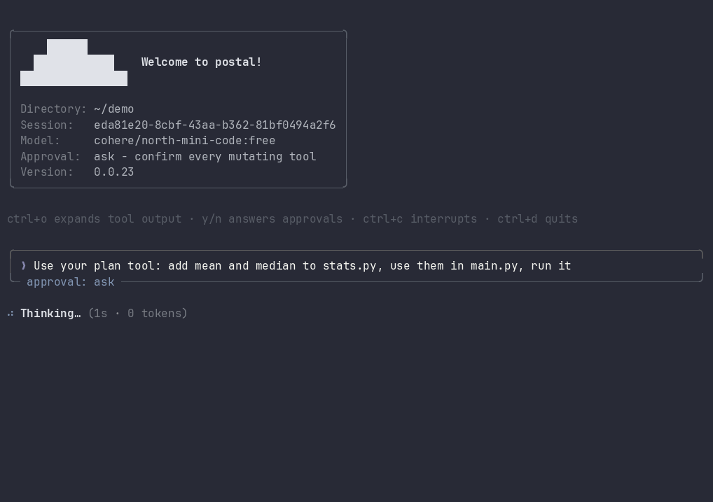

<h1 align='center'>
  Postal
</h1>

<p align="center">
  <b>An open-source AI coding agent that lives in your terminal.</b><br />
  Plans, edits, runs, and reviews code with any model on OpenRouter.
</p>

<p align="center">
  <a href="https://github.com/andrefetch/postal/stargazers"></a>
  <a href="https://github.com/andrefetch/postal/network/members"></a>
  <a href="https://github.com/andrefetch/postal/issues"></a>
</p>

<p align="center">
  
  
  
  
  
  <br />
  
  
  
</p>

<p align="center">
  
</p>

Postal connects to LLMs through OpenRouter, reads and edits your code with a built-in tool set, runs shell commands, delegates to specialized sub-agents, and streams everything through a full-screen TUI. Every mutating action goes through an approval policy you control, so it is as autonomous or as careful as you want it to be.

## Quickstart

Two commands and you are talking to an agent in your own repo:

```bash
pip install postalcli
postal login    # opens your browser to authorize with OpenRouter
postal          # start the interactive TUI
```

More ways to run it:

```bash
postal "your prompt"    # single-shot mode, great for scripting
postal --cwd /path      # run against a different working directory
postal login --paste    # paste an API key instead of browser OAuth
postal logout           # remove the saved API key
```

Model, temperature, and context window live in `~/.config/postal/config.toml`, with per-project overrides in `.postal/config.toml`:

```toml
[model]
name = "anthropic/claude-sonnet-4.5"

[reasoning]
enabled = true     # ask the model to think (ignored by models that cannot)
effort = "medium"  # "minimal", "low", "medium", "high", or omit for the provider default
# max_tokens = 4000  # a thinking budget instead of an effort level
visible = true     # stream the thinking into the transcript
```

## Why Postal?

- **Bring any model.** OpenRouter as the backend means one login gives you Claude, GPT, Gemini, DeepSeek, open-weight models, and whatever ships next. No vendor lock-in.
- **Safety is a first-class feature.** Six approval policies, dangerous-command rejection, and confirmation for anything outside the working directory. You choose the risk level, not the agent.
- **It survives long sessions.** Context pruning reclaims tokens from stale tool output, and when the window fills up, Postal compacts history into a continuation brief and keeps going instead of erroring out.
- **Hackable by design.** A readable Python codebase built on Rich, Click, and Pydantic. Adding a tool or a sub-agent is a small, well-marked change.

## What it can do

### Tools
| | |
| --- | --- |
| **Files** | `read`, `write`, `edit`, `grep`, `glob`, and `list_directories` for working with a codebase. |
| **Shell** | The `shell` tool executes commands in the working directory. |
| **Planning** | A `plan` tool tracks steps (a todo list) across the agent loop. |
| **Network** | Web search via DuckDuckGo and URL fetching. |
| **Memory** | Key-value storage that survives across sessions. |
| **MCP** | Connects to external MCP servers for additional tools and data sources. |

### Agent
| | |
| --- | --- |
| **Sub-agents** | Specialized agents the main agent can delegate to: `codebase_investigator`, `code_reviewer`, `software_architect`, `test_writer`, `debugger`. |
| **Approvals** | Mutating tool calls are gated by an approval policy, from confirming every write to running unattended. See [Approvals](#approvals). |
| **`AGENTS.md`** | Project instructions are picked up automatically and followed while working. |
| **Context pruning** | Old tool outputs are cleared once they pile up past the recent working set, reclaiming tokens without touching the conversation itself. |
| **Compaction** | When the context window fills up, history is summarized into a continuation brief and the session resumes from it instead of erroring out. |

### Interface
| | |
| --- | --- |
| **Interactive TUI** | Full-screen terminal interface built on Rich, with streaming responses, live tool call output, and token usage tracking. |
| **Visible thinking** | Reasoning models stream their thinking into the transcript before the answer, dimmed under a gutter. Tune or hide it with `/thinking`. |
| **Slash commands** | Control the session without leaving it. See [Slash commands](#slash-commands). |
| **Single-shot mode** | Pass a prompt as an argument for non-interactive runs, suitable for scripting. |

<p align="center">
  
</p>

## Slash commands

Type `/` in the TUI to drive the session directly:

| Command | What it does |
| --- | --- |
| `/help` | Show all commands |
| `/model <name>` | Switch models mid-session |
| `/approval <mode>` | Switch the approval policy mid-session |
| `/thinking [on\|off\|low\|medium\|high]` | Show, hide, or retune the model's reasoning |
| `/clear` | Clear conversation history |
| `/config` | Show the active configuration |
| `/stats` | Session statistics: tokens, elapsed time, tool calls |
| `/tools` | List available tools |
| `/mcp` | Show MCP server status |
| `/exit`, `/quit` | Leave the agent |

## Approvals

Before Postal runs anything that changes state, the approval policy decides whether it goes ahead, asks you, or is refused outright. Read-only tools (`read`, `grep`, `glob`, `list_directories`, `plan`) never prompt, so a policy only affects writes, shell commands, network calls, memory writes, MCP tools, and sub-agent runs.

| Value | Badge | Behaviour |
| --- | --- | --- |
| `on_request` *(default)* | `ask` | Confirm every mutating tool call. Commands matched as known-safe (`ls`, `git status`, `grep`, …) run without asking. |
| `auto_edit` | `auto-edit` | File edits and writes inside the working directory go through unprompted; shell commands still need confirmation unless known-safe. |
| `auto` | `auto` | Everything runs except dangerous commands, which are rejected. |
| `on_fail` | `on fail` | Currently identical to `auto`. Reserved for prompting after a failed tool call, which is not implemented yet. |
| `never` | `read-only` | Rejects anything that isn't a known-safe command. Nothing gets written, and you are never prompted. |
| `yolo` | `yolo` | Approves everything, including commands matched as dangerous. Only use this in a sandbox or container. |

Two rules apply on top of the policy, and no policy except `yolo` overrides them:

- **Dangerous commands are rejected.** `rm -rf /`, `dd if=`, `mkfs`, `shutdown`, `curl … | bash`, fork bombs, and similar patterns are refused before the shell ever sees them (the full list is `DANGEROUS_PATTERNS` in `safety/approval.py`).
- **Anything touching a path outside the working directory is confirmed**, however permissive the policy is (`never` rejects it instead).

The active policy is printed at startup and shown in the prompt badge, colour-coded by risk: normal for `ask`, `auto-edit` and `read-only`, amber for `auto` and `on fail`, red for `yolo`.

### Answering a prompt

When confirmation is needed, Postal pauses the stream and shows the tool, its arguments, the command it wants to run, and a diff for file edits:

```text
❎ edit  needs your approval
Edit postal/config/config.py
╰️---------------------------------------------️
╿ approval: ApprovalPolicy = ON_REQUEST ╿
╿+ approval: ApprovalPolicy = AUTO_EDIT  ╿
╰️---------------------------------------------️
y accept  ·   n reject  ·   esc reject   approval: ask - confirm every mutating tool
```

`y`, `a` or `enter` approves; `n`, `d`, `q`, `esc` or `ctrl+c` rejects. A rejection is fed back to the agent as a failed tool call, so it can pick a different approach rather than stopping.

> [!NOTE]
> One gap to be aware of: sub-agents run with their own auto-approving manager, so tool calls they make are not routed to you. Extending confirmations to sub-agents is on the [roadmap](#roadmap).

>>>>>>> Stashed changes
## Project instructions (`AGENTS.md`)

Drop an `AGENTS.md` at the root of your repo and Postal loads it as developer instructions at startup. Use it for build and test commands, code style, or anything else the agent should know before touching your code.

Postal walks up from the working directory to the repository root, so running `postal` inside a subdirectory still picks up the root file. Every `AGENTS.md` found along the way is included, ordered outermost first.

```markdown
# AGENTS.md

## Commands
- Test: `pytest`
- Lint: `ruff check .`

## Style
- Type hints on all public functions.
```

The scope of an `AGENTS.md` file is the directory tree it sits in, and the more deeply nested file wins on conflicts. Files below the working directory are read on demand as the agent works in those subdirectories. Instructions you give directly in a prompt always take precedence over `AGENTS.md`.

## Roadmap

Currently being worked on:

- **Session management**: saving, resuming, and switching between sessions.
- **Approval flow**: extending confirmations to sub-agent tool calls, and implementing the `on_fail` policy.

Have an idea? [Open an issue](https://github.com/andrefetch/postal/issues), feature discussions are very welcome.

## Contributing

Contributions of every size are appreciated, from typo fixes to new tools and sub-agents. Read [CONTRIBUTING.md](CONTRIBUTING.md) to get started, and check the [open issues](https://github.com/andrefetch/postal/issues) for something to pick up.

If Postal is useful to you, **a star on the repo genuinely helps** the project reach more developers. ⭐

## License

[GNU GENERAL PUBLIC LICENSE v3.0](LICENSE)
